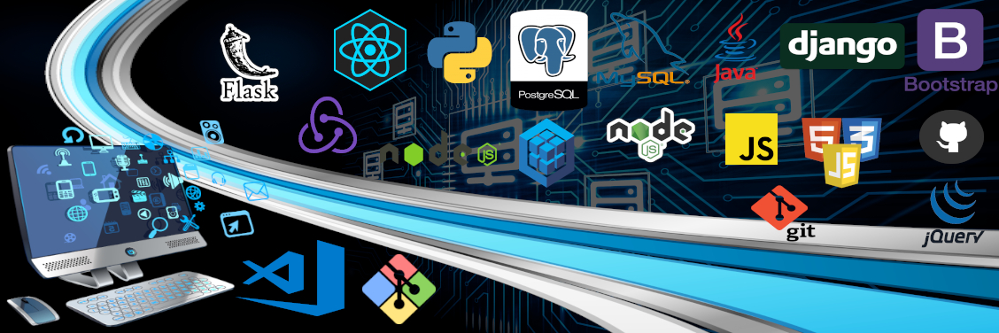
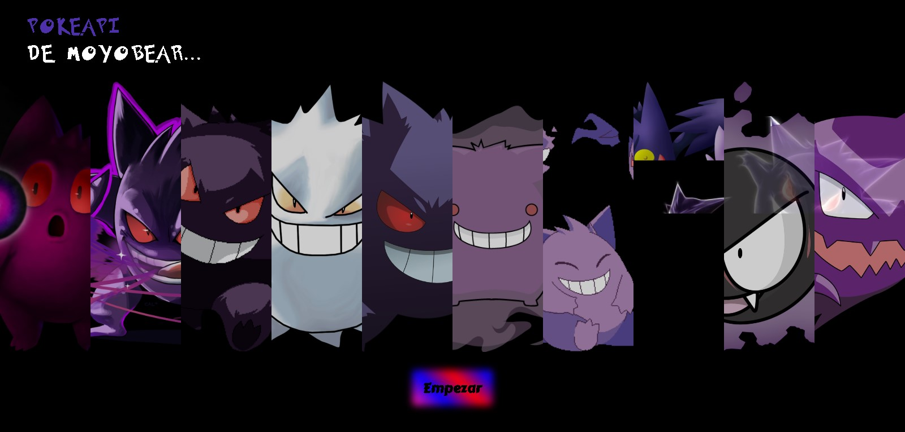
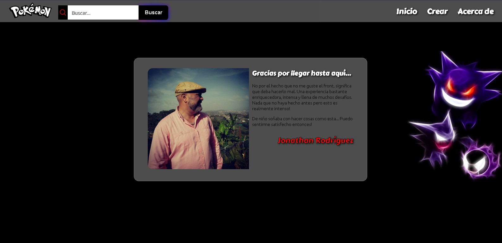
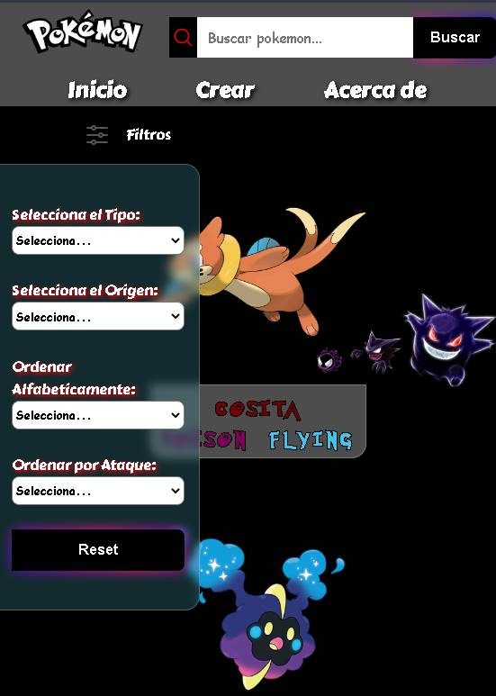
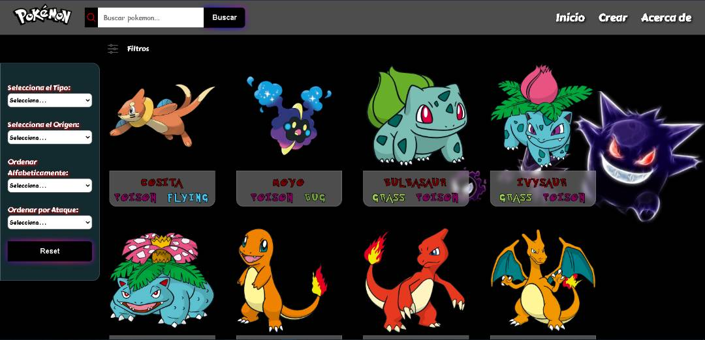

## 
Bienvenidos 👋 es un gusto saludarles 😀

### Mi nombre es `Jonathan Rodríguez`, soy de Venezuela y estoy aquí para ofrecerles una potente y eficiente solución.

Fullstack Developer con 3 años de experiencia en el desarrollo frontend y 10 años de experiencia en la gestión de Talento Humano. Soy apasionado por la tecnología y la innovación, con un amplio conocimiento en diversas herramientas y lenguajes, incluyendo HTML, CSS, JavaScript, SCSS, React, Tailwind, MUI, Chakra UI, Next.js, Redux, NodeJS, SQLite3, Sequelize y PostgreSQL. Además, tengo habilidades en la metodología Scrum, tanto como Scrum Master como desarrollador. Mi experiencia me permite ofrecer soluciones completas y eficaces, desde el diseño y la implementación del frontend hasta la gestión y optimización del backend.

Estoy siempre en busca de nuevos desafíos y oportunidades para seguir creciendo profesional y personalmente, y contribuir a proyectos que marquen una diferencia.

 

## 📌My Skill Set

<table><tr><td valign="top" width="33%">

### Frontend

  
  
  
  
  
  
  
  
  
  

</td><td valign="top" width="33%">

### Backend

  
  
  
  
  
  
  
  
  
  

</td><td valign="top" width="33%">

<!-- ### DevOps   -->

  
  

</td></tr></table>

 

## 📌Proyects

⚡ `Proyecto Individual` - Fase Académica Henry Bootcamp - `API Pokemon`: SPA (Single Page Application) creada de manera responsive, aplicando la metodología CRUD, utilizando:

- Para el Front End: React, Redux, Axios, CSS-modules.
- Para el Back End: Node Js, Express Js, Sequelize, PostgreSQL, Nodemon, Morgan, Insomnia.
      
   

⚡ `Proyecto Final` - Fase Académica Henry Bootcamp - `Vitality Medical Group`: Proyecto grupal creado en colaboración con 7 desarrolladores más. Se trata de una aplicación que permite la gestión, autogestión y administración de turnos y servicios médicos de manera remota. Permite registrar al usuario, ofrecerle planes médicos y en función del plan seleccionado y pagado, agregar un grupo familiar; facilita la gestión de turnos médicos, seleccionando por la especialidad del galeno, el día y la hora; autogestión de turnos para análisis médicos; pasarela de pagos; mailing automático; autenticación; y la posibilidad de interactuar con un chatbot para orientar al usuario en los servicios que se prestan; reviews entre otras.

Mi rol dentro de este proyecto consistió en liderar el equipo del Back End y ser responsable de la escalabilidad y estabilidad de la aplicación frente a los requerimientos por parte del equipo del Front, aunado a mi responsabilidad además como desarrollador Fullstack.

Su construcción fue basada en la metodología ágil Scrum, y se implementaron las siguientes tecnologías:

- Para el Front End: Vite, Redux, Material-UI, JavaScript, MercadoPago, Auth0, Axios.
- Para el Back End: Node Js, Sequelize, Express, PostgreSQL, Morgan, MercadoPago, Auth0, Googleapis.

`Link para ver la presentación en video del proyecto`: https://www.youtube.com/watch?v=Bpji8kSCtjw
 

## 📌Connect with me

  

 
